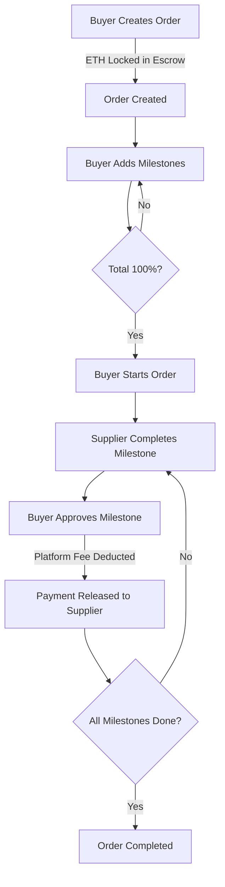

# Architecture Overview

## System Design

The Supply Chain Payment Automation system uses a trustless escrow mechanism with milestone-based payment releases on Base Ethereum.

## Smart Contract Architecture

### Inheritance Hierarchy

```
SupplyChainPayment
├── Ownable (OpenZeppelin)
└── ReentrancyGuard (OpenZeppelin)
```

### Data Structures

#### Supplier
```solidity
struct Supplier {
    address supplierAddress;
    string name;
    string contactInfo;
    bool isVerified;
    uint256 totalOrdersCompleted;
    uint256 totalAmountEarned;
    uint256 registrationDate;
}
```

#### Milestone
```solidity
struct Milestone {
    string description;
    uint256 paymentPercentage;  // 0-100
    bool isCompleted;
    bool isApproved;
    uint256 completionDate;
    uint256 approvalDate;
}
```

#### Order
```solidity
struct Order {
    uint256 orderId;
    address buyer;
    address supplier;
    string productDescription;
    uint256 totalAmount;
    uint256 paidAmount;
    uint256 createdDate;
    OrderStatus status;
    Milestone[] milestones;
    bool disputeRaised;
    string disputeReason;
}
```

## Payment Flow



## State Machine

### Order Status Flow

```
Created → InProgress → Completed
   ↓           ↓
Cancelled   Disputed
```

- **Created**: Order created, milestones being added
- **InProgress**: Order started, milestones being completed
- **Completed**: All milestones approved, order finished
- **Cancelled**: Order cancelled before starting
- **Disputed**: Dispute raised, awaiting resolution

## Security Patterns

### 1. Checks-Effects-Interactions
All state changes occur before external calls:
```solidity
// ✅ Correct pattern
milestone.isApproved = true;  // State change
order.paidAmount += amount;   // State change
(bool success, ) = payable(supplier).call{value: amount}("");  // External call
```

### 2. Reentrancy Protection
`nonReentrant` modifier on all payment functions:
- `approveMilestone()`
- `resolveDispute()`
- `cancelOrder()`
- `withdrawPlatformFees()`

### 3. Access Control
Role-based modifiers:
- `onlyOwner` - Platform administration
- `onlyBuyer` - Order management
- `onlySupplier` - Milestone completion
- `validSupplier` - Verified suppliers only

### 4. Input Validation
Comprehensive require statements:
- Non-zero amounts
- Valid percentages (0-100)
- Non-empty strings
- Correct order states

## Gas Optimization Strategies

### 1. Storage Optimization
- Use mappings for O(1) lookups
- Pack struct variables efficiently
- Minimize storage writes

### 2. Loop Optimization
- Limit loop iterations
- Use storage pointers
- Cache array lengths

### 3. Event Emissions
- Emit events for off-chain indexing
- Reduce on-chain data storage

## Upgrade Path

Current implementation is non-upgradeable. For upgradeability:

1. **Proxy Pattern**: Use UUPS or Transparent Proxy
2. **Storage Gaps**: Add `__gap` variables
3. **Initialization**: Replace constructor with `initialize()`

## Integration Points

### Frontend Integration
```javascript
// Connect to contract
const contract = new ethers.Contract(address, abi, signer);

// Listen to events
contract.on("OrderCreated", (orderId, buyer, supplier, amount) => {
    console.log(`New order ${orderId} created`);
});

// Call functions
await contract.createOrder(supplier, description, { value: amount });
```

### Subgraph Integration
Index events for efficient querying:
- SupplierRegistered
- OrderCreated
- MilestoneApproved
- PaymentReleased

## Scalability Considerations

### Current Limitations
- All data stored on-chain (expensive)
- Linear search for some operations
- No pagination for order lists

### Potential Improvements
1. **IPFS Integration**: Store large data off-chain
2. **Indexed Mappings**: Add reverse lookups
3. **Batch Operations**: Process multiple milestones
4. **Layer 2**: Deploy on Base (already optimized for L2)

## Testing Strategy

### Unit Tests
- Individual function testing
- Edge case validation
- Access control verification

### Integration Tests
- Full order lifecycle
- Multi-milestone scenarios
- Dispute resolution flows

### Gas Profiling
```bash
REPORT_GAS=true npx hardhat test
```

## Deployment Checklist

- [ ] Audit smart contract code
- [ ] Deploy to testnet (Base Sepolia)
- [ ] Verify on BaseScan
- [ ] Test all functions on testnet
- [ ] Set up monitoring and alerts
- [ ] Deploy to mainnet (Base)
- [ ] Transfer ownership to multisig

## Monitoring

### Key Metrics
- Total orders created
- Total value locked (TVL)
- Platform fees collected
- Average order completion time
- Dispute rate

### Events to Monitor
- Large orders (>10 ETH)
- Disputes raised
- Failed transactions
- Unusual activity patterns

## Future Enhancements

1. **Multi-token Support**: Accept ERC20 tokens
2. **Reputation System**: Track supplier performance
3. **Automated Dispute Resolution**: Oracle integration
4. **Partial Payments**: Allow milestone splitting
5. **Insurance Integration**: Optional order insurance
6. **DAO Governance**: Community-driven platform fees
